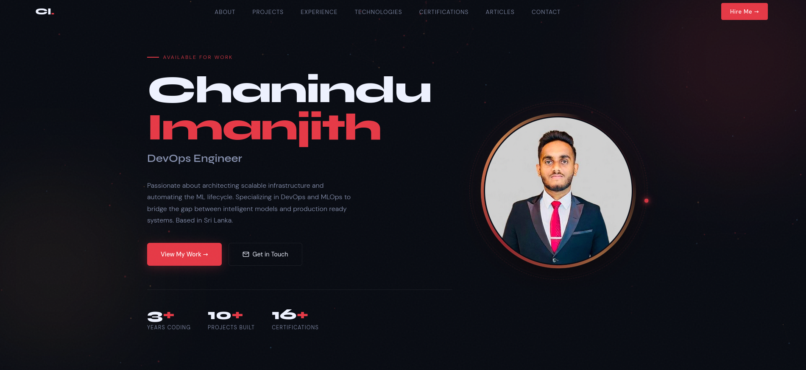

Chanindu Imanjith — Personal Portfolio Website

A modern, responsive personal portfolio website built with HTML, CSS, and JavaScript. Features smooth animations, particle effects, and a clean dark theme.

🔗 Live Demo

👉 [https://chanindu-imanjith.netlify.app](https://chanindu-imanjith.netlify.app)

 📸 Preview

 🛠️ Built With

- HTML5 — Semantic markup
- CSS3 — Custom animations, transitions, flexbox & grid
- JavaScript — Vanilla JS for interactions and animations
- Google Fonts — Syne & DM Sans
- Formspree — Contact form email service
- Netlify — Hosting & deployment

 ✨ Features

- 🎨 Dark theme with red accent color
- 🌟 Animated particle background
- ⌨️ Typing animation for role titles
- 🖼️ Animated profile photo with tilt effect
- 📱 Fully responsive — mobile, tablet & desktop
- 🔗 Clickable certification cards with credential URLs
- 📜 Smooth scroll reveal animations
- 🏷️ Infinite scrolling tech stack marquee
- 📬 Working contact form with email notifications
- 📄 CV download button

 📁 Project Structure

PORTFOLIO/
├── images/
│   ├── portfolio_dp.png
│   └── portfolio.png
├── cv.pdf
├── index.html
├── README.md
├── script.js
└── style.css

